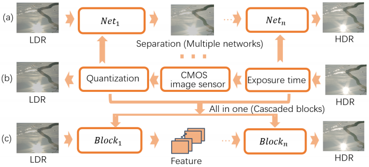
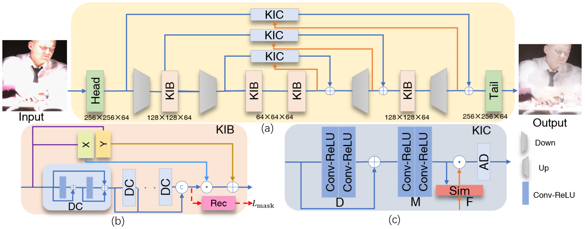

# TODO

- [x] Submit source code
- [x] Submit implementation details
- [ ] Submit appendex
- [ ] Perfect link to the paper
- [x] Citation
- [ ] Acknowledgment
- [x] Getting Started

# KUNet[Paper Link]

IJCAI2022 (long oral)

# Overview

 Comparison between the method of reversing the camera imaging pipeline and our method:



Overview of the method:



# Implementation details

For the Head, Tail, D block of KIB module and KIC module, we use $3\times 3$ convolution with a step size of 1, and for the X and Y branches in the KIB module, we use $1 \times 1$ convolution. The activation function of all networks is ReLU function. Except for input and output layers, the channels of feature maps are all 64. The down-sampling operation uses a $3 \times 3$ convolution operation with a step size of 2. Up-sampling operation uses PixelShuffle[1]. We use ADAM optimizer[2] with the learning rate of $2e^{-4}$ decayed by a factor of 2 after every $20K$ iterations. The batch size is 12. All models are built on the PyTorch framework and trained with NVIDIA GeForce RTX 2080 SUPER. The total training time is about 6 days. 

# Getting Started


## Dataset

We use two data sets to evaluate our method, i.e.,for image and video tasks. Both of these two data sets contain information about moving light sources, rich colors, high

lights and bright. For the image task ,we use NTIRE 2021 dataset. They are 1416 paired training images and 78 test images. For the video task, we conduct experiment on **HDRTV**[3]. This dataset contains 1235 paired training pictures and 117 test pictures. Please refer to the paper for the details on the processing of this dataset. This dataset can be downloaded from [Baidu Netdisk](https://pan.baidu.com/s/1YfdFYD03KMyhKnpDo9nnZw)(accsee code: mpr6) .

## Configure

```bash
h5py==3.6.0
lmdb==1.2.1
pandas==1.1.5
pillow==8.4.0
prefetch-generator==1.0.1
py-opencv==4.5.2
python==3.7.0
pytorch==1.9.0
scikit-image==0.18.3
scipy==1.7.0
tensorboard==2.8.0
torchvision==0.2.2
tqdm==4.61.2
yaml==0.2.5
```

## How to test

we provide the pretrained models to test, which can be downloaded from the link provided by the dataset. Please put the obtained files into models according to the instructions. 

-  Modify the pictures and model paths in the *.yml file(`cd code/options/test.` )

- ```bash
  cd code/
  python .\test.py -opt .\options\test\KIB_mask.yml
  ```

## How to train

- Prepare the data. Generate the sub-images with specific path size using ```./scripts/extract_subimgs_single.py``` 

- make sure that the paths and settings in `./options/train/train_KIB.yml` are correct,then run

  ```bash
  cd codes
  ```

- For the image task 

  ```bash
  python train.py -opt option/train/train_KIB.yml
  ```

-  For the video task 

  ```bash
  python train.py -opt option/train/train_hdrtv.yml 
  ```

- All models and training states are stored in `./experiments`.

## Metrics

Two metrics are used to evaluate the quantitative performance of different methods on image tasks, including $PSNR$ and $\mu-psnr$ . Five metrics are used to evaluate the quantitative performance of different methods on video tasks, including PSNR, SSIM, SR_SIM, Delta EITP (ITU Rec.2124)and HDR-VDP3. we provide some reference codes in `./metrics` for convenient usage.

# Reference

1. W. Shi, J. Caballero, F. Husz´ar, J. Totz, A.P.

   Aitken, R. Bishop, D. Rueckert, and Z. Wang. Real-time single image and video super-resolution using an effificient sub-pixel convolutional neural network. In *CVPR*, pages 1874–1883, 2016.

2. H. Scharr. Optimal filters for extended optical flow. In IWCM, pages 14–29. Springer

3. X. Chen, Z. Zhang, J. Ren, L. Tian, Y. Qiao, and C. Dong. A new journey from SDRTV to HDRTV. In *ICCV*,

   pages 4500–4509, 2021.

# Ackonwledgment

The code and format is inspired by [HDRTV](https://github.com/chxy95/HDRTVNet.git)

